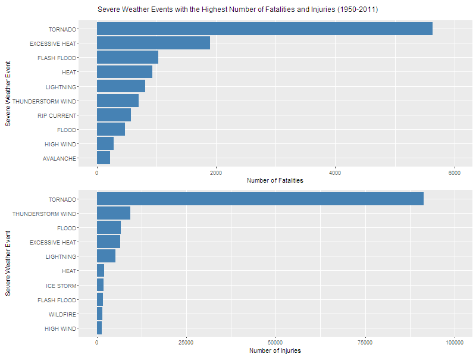

## The Impact of Severe Weather Events on the Public Health and Economy of the USA

### Synopsis

This analysis uses the U.S. National Oceanic and Atmospheric Administration's storm database for 1950 through November 2011 which tracks characteristics of major storms and weather events in the US, including when and where they occur in the US, as well as estimates of any fatalities, injuries and property damage. Through the following analysis it will be shown that tornadoes have the most severe impact on public health, and that flash floods and thunderstorm winds cause the most property damage, while drought and flood cause the most crop damage.

### Data Processing

1. Prepare directory structure and download data
```{r echo = TRUE}

if (!dir.exists("data"))
{
    dir.create("data")
}

if (!dir.exists("figure"))
{
    dir.create("figure")
}

if (!"stormData.csv.bz2" %in% dir("./data/"))
{
    download.file("https://d396qusza40orc.cloudfront.net/repdata%2Fdata%2FStormData.csv.bz2", destfile = "data/stormData.csv.bz2")
}
```

2. Read in the bz2 compressed csv file
```{r cache = TRUE}
if (!"stormData" %in% ls())
{
    stormData <- read.csv("data/stormData.csv.bz2")
}
```

3. Subset data based on columns relevant to this analysis
    * EVTYPE        (event type)
    * FATALITIES    (number of fatalities)
    * INJURIES      (number of injuries)
    * PROPDMG       ($ value of property damage)
    * PROPDMGEXP    (multiplier for PROPDMG)
    * CROPDMG       ($ value of crop damage)
    * CROPDMGEXP    (multiplier for CROPDMG)
```{r cache = TRUE}
subColumns = grep("EVTYPE|FATALITIES|INJURIES|DMG", names(stormData))
subData = as.data.frame(stormData[,subColumns])
```

4. Convert all event types to uppercase for standardization of naming
```{r}
subData$EVTYPE <- toupper(subData$EVTYPE)
```

5. Create function to convert exponential multiplier to numeric value for estimating property damage
    ```{r}
    convert_exp_mult <- function(e) {
        # h = hundred
        # k = thousand
        # m = million
        # b = billion
        if (e %in% c('h', 'H'))
            return(2)
        else if (e %in% c('k', 'K'))
            return(3)
        else if (e %in% c('m', 'M'))
            return(6)
        else if (e %in% c('b', 'B'))
            return(9)
        else if (!is.na(as.numeric(e))) # if a digit
            return(as.numeric(e))
        else if (e %in% c('', '-', '?', '+'))
            return(0)
        else {
            stop("Not a valid exponent value")
        }
    }
    ```

6. Convert all encoded property and crop damage values to standard notation
and append to subData as a new column
    ```{r cache = TRUE}
    propDamageExp <- sapply(subData$PROPDMGEXP, FUN = convert_exp_mult)
    subData$PROP_DAMAGE <- subData$PROPDMG * (10 ^ propDamageExp)
    cropDamageExp <- sapply(subData$CROPDMGEXP, FUN = convert_exp_mult)
    subData$CROP_DAMAGE <- subData$CROPDMG * (10 ^ cropDamageExp)
    ```

The resulting subData frame contains all data between 1950 and November 2011, but has been processed and stripped down to the columns noted as relevant for this data analysis.

Now the process will begin of identifying which severe weather events have had the biggest impact on public health and the economy of the USA.

### Impact of severe weather events on public health
1. Subset data to all data with FATALITIES > 0
```{r}
aggFatalities <- subset(subData, FATALITIES > 0)
```

2. Standardize naming for event types
```{r}
aggFatalities$EVTYPE <- gsub("AVALANCE", "AVALANCHE", aggFatalities$EVTYPE)
aggFatalities$EVTYPE <- gsub("FLOODING", "FLOOD", aggFatalities$EVTYPE)
aggFatalities$EVTYPE <- gsub("FLOODS", "FLOOD", aggFatalities$EVTYPE)
aggFatalities$EVTYPE <- gsub("/FLOOD", "", aggFatalities$EVTYPE)
aggFatalities$EVTYPE <- gsub("FLOOD/", "", aggFatalities$EVTYPE)
aggFatalities$EVTYPE <- gsub("COASTALSTORM", "COASTAL STORM", aggFatalities$EVTYPE)
aggFatalities$EVTYPE <- gsub("WINDS", "WIND", aggFatalities$EVTYPE)
aggFatalities$EVTYPE <- gsub("LANDSLIDES", "LANDSLIDE", aggFatalities$EVTYPE)
aggFatalities$EVTYPE <- gsub("LIGHTNING.", "LIGHTNING", aggFatalities$EVTYPE)
aggFatalities$EVTYPE <- gsub("MUDSLIDES", "MUDSLIDE", aggFatalities$EVTYPE)
aggFatalities$EVTYPE <- gsub("CURRENTS", "CURRENT", aggFatalities$EVTYPE)
aggFatalities$EVTYPE <- gsub("SQUALLS", "SQUALL", aggFatalities$EVTYPE)
aggFatalities$EVTYPE <- gsub("THUNDERTORM", "THUNDERSTORM", aggFatalities$EVTYPE)
aggFatalities$EVTYPE <- gsub("TSTM", "THUNDERSTORM", aggFatalities$EVTYPE)
aggFatalities$EVTYPE <- gsub("WILD FIRES", "WILDFIRE", aggFatalities$EVTYPE)
aggFatalities$EVTYPE <- gsub("STORMS", "STORM", aggFatalities$EVTYPE)
```

3. Sum all fatalities according to event type
```{r}
sumFatalities <- aggregate(x = list(totalFatal=aggFatalities$FATALITIES),
                           by = list(uniqueEvent=aggFatalities$EVTYPE),
                           FUN = sum, na.rm = TRUE)
```

4. Order event type by number of fatalities (decreasing)
```{r}
attach(sumFatalities)
sumFatalities <- sumFatalities[order(-totalFatal),]
detach(sumFatalities)
```

5. View top ten event type by highest number of fatalities
```{r}
toptenFatalities <- sumFatalities[1:10, ]
sumFatalities[1:10, ]
```

6. Subset data to all data with INJURIES > 0
```{r}
aggInjuries <- subset(subData, INJURIES > 0)
```

7. Standardize naming for event types
```{r}
aggInjuries$EVTYPE <- gsub("AVALANCE", "AVALANCHE", aggInjuries$EVTYPE)
aggInjuries$EVTYPE <- gsub("FLOODING", "FLOOD", aggInjuries$EVTYPE)
aggInjuries$EVTYPE <- gsub("FLOODS", "FLOOD", aggInjuries$EVTYPE)
aggInjuries$EVTYPE <- gsub("/FLOOD", "", aggInjuries$EVTYPE)
aggInjuries$EVTYPE <- gsub("FLOOD/", "", aggInjuries$EVTYPE)
aggInjuries$EVTYPE <- gsub("COASTALSTORM", "COASTAL STORM", aggInjuries$EVTYPE)
aggInjuries$EVTYPE <- gsub("WINDS", "WIND", aggInjuries$EVTYPE)
aggInjuries$EVTYPE <- gsub("LANDSLIDES", "LANDSLIDE", aggInjuries$EVTYPE)
aggInjuries$EVTYPE <- gsub("LIGHTNING.", "LIGHTNING", aggInjuries$EVTYPE)
aggInjuries$EVTYPE <- gsub("LIGHTNINGNJURY", "LIGHTNING", aggInjuries$EVTYPE)
aggInjuries$EVTYPE <- gsub("MISHAP", "ACCIDENT", aggInjuries$EVTYPE)
aggInjuries$EVTYPE <- gsub("MUDSLIDES", "MUDSLIDE", aggInjuries$EVTYPE)
aggInjuries$EVTYPE <- gsub("CURRENTS", "CURRENT", aggInjuries$EVTYPE)
aggInjuries$EVTYPE <- gsub("SQUALLS", "SQUALL", aggInjuries$EVTYPE)
aggInjuries$EVTYPE <- gsub("THUNDERTORM", "THUNDERSTORM", aggInjuries$EVTYPE)
aggInjuries$EVTYPE <- gsub("TSTM", "THUNDERSTORM", aggInjuries$EVTYPE)
aggInjuries$EVTYPE <- gsub("WILD FIRES", "WILDFIRE", aggInjuries$EVTYPE)
aggInjuries$EVTYPE <- gsub("STORMS", "STORM", aggInjuries$EVTYPE)
aggInjuries$EVTYPE <- gsub("RAINS", "RAIN", aggInjuries$EVTYPE)
aggInjuries$EVTYPE <- gsub("/FOREST ", "", aggInjuries$EVTYPE)
aggInjuries$EVTYPE <- gsub(".*MIX", "", aggInjuries$EVTYPE)
```

8. Sum all injuries according to event type
```{r}
sumInjuries <- aggregate(x = list(totalInjuries=aggInjuries$INJURIES),
                         by = list(uniqueEvent=aggInjuries$EVTYPE),
                         FUN = sum, na.rm = TRUE)
```

9. Order event type by number of injuries (decreasing)
```{r}
attach(sumInjuries)
sumInjuries <- sumInjuries[order(-totalInjuries),]
detach(sumInjuries)
```

10. View top ten event type by highest number of injuries
```{r}
toptenInjuries <- sumInjuries[1:10, ]
sumInjuries[1:10, ]
```

### Impact of severe weather events on economy
1. Subset data to all data with property or crop damages > 0
```{r}
aggEconomic <- subset(subData, PROPDMG > 0 | CROPDMG > 0)
```

2. Standardize naming for event types (this could almost go on forever)
```{r}
aggEconomic$EVTYPE <- gsub("WIND CHILL", "WINDCHILL", aggEconomic$EVTYPE)
aggEconomic$EVTYPE <- gsub("FLOODING", "FLOOD", aggEconomic$EVTYPE)
aggEconomic$EVTYPE <- gsub("FLOODS", "FLOOD", aggEconomic$EVTYPE)
aggEconomic$EVTYPE <- gsub("FLOOD FLASH", "FLASH FLOOD", aggEconomic$EVTYPE)
aggEconomic$EVTYPE <- gsub("FLOOD/FLASH", "FLASH FLOOD", aggEconomic$EVTYPE)
aggEconomic$EVTYPE <- gsub("WINDS", "WIND", aggEconomic$EVTYPE)
aggEconomic$EVTYPE <- gsub("HIGH WIND/", "HIGH WIND", aggEconomic$EVTYPE)
aggEconomic$EVTYPE <- gsub("HAIL DAMAGE", "HAIL", aggEconomic$EVTYPE)
aggEconomic$EVTYPE <- gsub("RAINS", "RAIN", aggEconomic$EVTYPE)
aggEconomic$EVTYPE <- gsub("SNOW-SQUALLS", "SNOW SQUALL", aggEconomic$EVTYPE)
aggEconomic$EVTYPE <- gsub("SNOW/SQUALLS", "SNOW SQUALL", aggEconomic$EVTYPE)
aggEconomic$EVTYPE <- gsub("SNOW SQUALLS", "SNOW SQUALL", aggEconomic$EVTYPE)
aggEconomic$EVTYPE <- gsub("LAKE-EFFECT", "LAKE EFFECT", aggEconomic$EVTYPE)
aggEconomic$EVTYPE <- gsub("LANDSLIDES", "LANDSLIDE", aggEconomic$EVTYPE)
aggEconomic$EVTYPE <- gsub("LIGHTING", "LIGHTNING", aggEconomic$EVTYPE)
aggEconomic$EVTYPE <- gsub("LIGNTNING", "LIGHTNING", aggEconomic$EVTYPE)
aggEconomic$EVTYPE <- gsub("MAJOR FLOOD", "FLOOD", aggEconomic$EVTYPE)
aggEconomic$EVTYPE <- gsub("MINOR FLOOD", "FLOOD", aggEconomic$EVTYPE)
aggEconomic$EVTYPE <- gsub("MUD SLIDE", "MUDSLIDE", aggEconomic$EVTYPE)
aggEconomic$EVTYPE <- gsub("MUD SLIDES", "MUDSLIDE", aggEconomic$EVTYPE)
aggEconomic$EVTYPE <- gsub("MUDSLIDES", "MUDSLIDE", aggEconomic$EVTYPE)
aggEconomic$EVTYPE <- gsub("THUDERSTORM", "THUNDERSTORM", aggEconomic$EVTYPE)
aggEconomic$EVTYPE <- gsub("THUNDEERSTORM", "THUNDERSTORM", aggEconomic$EVTYPE)
aggEconomic$EVTYPE <- gsub("THUNDERESTORM", "THUNDERSTORM", aggEconomic$EVTYPE)
aggEconomic$EVTYPE <- gsub("WIND.", "WIND", aggEconomic$EVTYPE)
aggEconomic$EVTYPE <- gsub("WINDS", "WIND", aggEconomic$EVTYPE)
aggEconomic$EVTYPE <- gsub("WINDSS", "WIND", aggEconomic$EVTYPE)
aggEconomic$EVTYPE <- gsub("WINS", "WIND", aggEconomic$EVTYPE)
aggEconomic$EVTYPE <- gsub("THUNDERSTORMS", "THUNDERSTORM", aggEconomic$EVTYPE)
aggEconomic$EVTYPE <- gsub("THUNDERSTROM", "THUNDERSTORM", aggEconomic$EVTYPE)
aggEconomic$EVTYPE <- gsub("THUNDERTORM", "THUNDERSTORM", aggEconomic$EVTYPE)
aggEconomic$EVTYPE <- gsub("TUNDERTORM", "THUNDERSTORM", aggEconomic$EVTYPE)
aggEconomic$EVTYPE <- gsub("THUNDERSTORMWINDS", "THUNDERSTORM WIND", aggEconomic$EVTYPE)
aggEconomic$EVTYPE <- gsub("THUNERSTORM WINDS", "THUNDERSTORM WIND", aggEconomic$EVTYPE)
aggEconomic$EVTYPE <- gsub("TORNDAO", "TORNADO", aggEconomic$EVTYPE)
aggEconomic$EVTYPE <- gsub("TSTM", "THUNDERSTORM", aggEconomic$EVTYPE)
aggEconomic$EVTYPE <- gsub("WATERSPOUT-", "WATERSPOUT", aggEconomic$EVTYPE)
aggEconomic$EVTYPE <- gsub("WATERSPOUTTORNADO", "WATERSPOUT TORNADO", aggEconomic$EVTYPE)
aggEconomic$EVTYPE <- gsub("WATERSPOUT/ TORNADO", "WATERSPOUT TORNADO", aggEconomic$EVTYPE)
aggEconomic$EVTYPE <- gsub("WATERSPOUT/TORNADO", "WATERSPOUT TORNADO", aggEconomic$EVTYPE)
aggEconomic$EVTYPE <- gsub("WILD/FOREST FIRE", "WILDFIRE", aggEconomic$EVTYPE)
aggEconomic$EVTYPE <- gsub("WILD/FOREST FIRES", "WILDFIRE", aggEconomic$EVTYPE)
aggEconomic$EVTYPE <- gsub("WILDFIRES", "WILDFIRE", aggEconomic$EVTYPE)
aggEconomic$EVTYPE <- gsub("WILD FIRES", "WILDFIRE", aggEconomic$EVTYPE)
aggEconomic$EVTYPE <- gsub("WIND DAMAGE", "WIND", aggEconomic$EVTYPE)
aggEconomic$EVTYPE <- gsub("STORMS", "STORM", aggEconomic$EVTYPE)
aggEconomic$EVTYPE <- gsub("WEATHER MIX", "WEATHER", aggEconomic$EVTYPE)
aggEconomic$EVTYPE <- gsub("WEATHER/MIX", "WEATHER", aggEconomic$EVTYPE)
aggEconomic$EVTYPE <- gsub("WINTRY MIX", "WINTER WEATHER", aggEconomic$EVTYPE)
aggEconomic$EVTYPE <- gsub("FLOODFLOOD", "FLOOD", aggEconomic$EVTYPE)
aggEconomic$EVTYPE <- gsub("FLOOD/FLOOD", "FLOOD", aggEconomic$EVTYPE)
aggEconomic$EVTYPE <- gsub("RAINTORM", "RAIN", aggEconomic$EVTYPE)
aggEconomic$EVTYPE <- gsub("THUNERSTORM", "THUNDERSTORM", aggEconomic$EVTYPE)
aggEconomic$EVTYPE <- gsub("THUNDERSTORMWIND", "THUNDERSTORM WIND", aggEconomic$EVTYPE)
aggEconomic$EVTYPE <- gsub("TUNDERSTORM", "THUNDERSTORM", aggEconomic$EVTYPE)
```

3. Sum all property damage according to event type
```{r}
sumPropDmg <- aggregate(x = list(totalPropDmg=aggEconomic$PROP_DAMAGE),
                        by = list(uniqueEvent=aggEconomic$EVTYPE),
                        FUN = sum, na.rm = TRUE)
```

4. Order event type by sum of property damage (decreasing)
```{r}
attach(sumPropDmg)
sumPropDmg <- sumPropDmg[order(-totalPropDmg),]
detach(sumPropDmg)
```

5. View top ten event type by largest sum of property damage
```{r}
toptenPropDmg <- sumPropDmg[1:10, ]
sumPropDmg[1:10, ]
```

6. Sum all crop damage according to event type
```{r}
sumCropDmg <- aggregate(x = list(totalCropDmg=aggEconomic$CROP_DAMAGE),
                        by = list(uniqueEvent=aggEconomic$EVTYPE),
                        FUN = sum, na.rm = TRUE)
```

7. Order event type by sum of crop damage (decreasing)
```{r}
attach(sumCropDmg)
sumCropDmg <- sumCropDmg[order(-totalCropDmg),]
detach(sumCropDmg)
```

8. View top ten event type by largest sum of crop damage
```{r}
toptenCropDmg <- sumCropDmg[1:10, ]
sumCropDmg[1:10, ]
```

### Results
1. Severe weather events with the highest number of fatalities and injuries
```{r FatalityInjuryPlot}
library(ggplot2)
library(grid)
# Make events factors and sort factors on total fatalities
toptenFatalities$uniqueEvent <- factor(toptenFatalities$uniqueEvent, levels = toptenFatalities$uniqueEvent[order(toptenFatalities$totalFatal)])
# Build the plot showing top ten events by fatalities
p1 <- ggplot(toptenFatalities, aes(uniqueEvent, totalFatal)) +
        geom_bar(stat = "identity", fill = "steelblue") +
        coord_flip() +
        scale_y_continuous(limits = c(0,6000)) +
        xlab("Severe Weather Event") +
        ylab("Number of Fatalities") +  
        theme_gray()

# Make events factors and sort factors on total injuries
toptenInjuries$uniqueEvent <- factor(toptenInjuries$uniqueEvent, levels = toptenInjuries$uniqueEvent[order(toptenInjuries$totalInjuries)])
# Build the plot showing top ten events by injuries
p2 <- ggplot(toptenInjuries, aes(uniqueEvent, totalInjuries)) +
        geom_bar(stat = "identity", fill = "steelblue") +
        coord_flip() +
        scale_y_continuous(limits = c(0,100000)) +
        xlab("Severe Weather Event") +
        ylab("Number of Injuries") +  
        theme_gray()

# Combine two plots into single figure and save
pushViewport(viewport(layout = grid.layout(3, 1, heights = c(0.5, 5, 5))))
grid.text("Severe Weather Events with the Highest Number of Fatalities and Injuries (1950-2011)", vp = viewport(layout.pos.row = 1,
                                      layout.pos.col = 1))
print(p1, vp = viewport(layout.pos.row = 2, layout.pos.col = 1))
print(p2, vp = viewport(layout.pos.row = 3, layout.pos.col = 1))
Sys.sleep(1)
dev.copy(png, "figure/FatInjPlot.png", width = 800, height = 600)
graphics.off()
```


2. Severe weather events with the biggest economic impacts
```{r PropCropDamagePlot}
# Make events factors and sort factors on total property damage
toptenPropDmg$uniqueEvent <- factor(toptenPropDmg$uniqueEvent, levels = toptenPropDmg$uniqueEvent[order(toptenPropDmg$totalPropDmg)])
# Build the plot showing top ten events by total property damage
p3 <- ggplot(toptenPropDmg, aes(uniqueEvent, totalPropDmg)) +
        geom_bar(stat = "identity", fill = "steelblue") +
        coord_flip() +
        xlab("Severe Weather Event") +
        ylab("Total Property Damage in Dollars") +  
        theme_gray()

# Make events factors and sort factors on total crop damage
toptenCropDmg$uniqueEvent <- factor(toptenCropDmg$uniqueEvent, levels = toptenCropDmg$uniqueEvent[order(toptenCropDmg$totalCropDmg)])
# Build the plot showing top ten events by injuries
p4 <- ggplot(toptenCropDmg, aes(uniqueEvent, totalCropDmg)) +
        geom_bar(stat = "identity", fill = "steelblue") +
        coord_flip() +
        xlab("Severe Weather Event") +
        ylab("Total Crop Damage in Dollars") +  
        theme_gray()

# Combine two plots into single figure and save
pushViewport(viewport(layout = grid.layout(3, 1, heights = c(0.5, 5, 5))))
grid.text("Severe Weather Events with the Highest Property and Crop Damage (1950-2011)", vp = viewport(layout.pos.row = 1,
                                      layout.pos.col = 1))
print(p3, vp = viewport(layout.pos.row = 2, layout.pos.col = 1))
print(p4, vp = viewport(layout.pos.row = 3, layout.pos.col = 1))
Sys.sleep(1)
dev.copy(png, "figure/PropCropPlot.png", width = 800, height = 600)
graphics.off()
```
